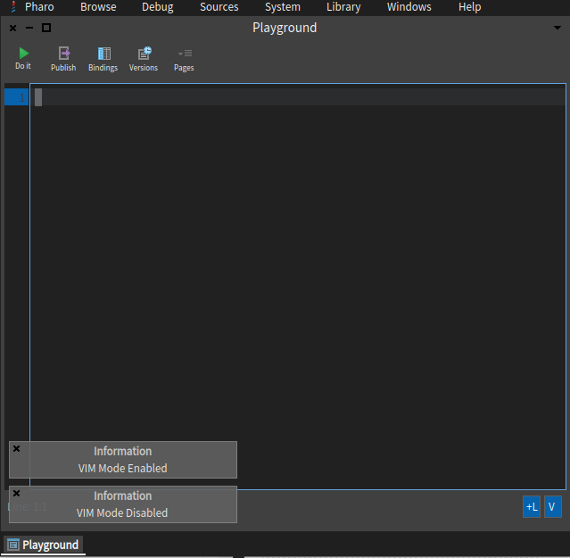

# PharoVimMode

Work in Progress

```
Metacello new
   baseline: 'PharoVimMode';
   repository: 'github://kotshie/PharoVimMode:main';
   load
```

Basic commands work.

[Current progress](./docs/bindings.md)

---
## Screenshot


Based on https://github.com/unchartedworks/SmalltalkVimMode
